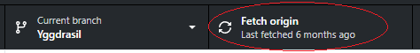
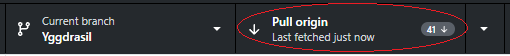
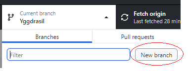
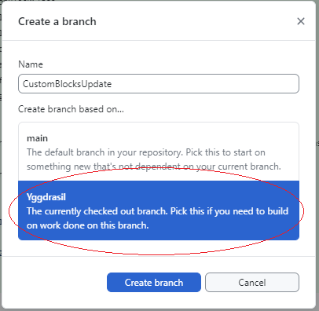
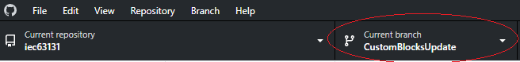
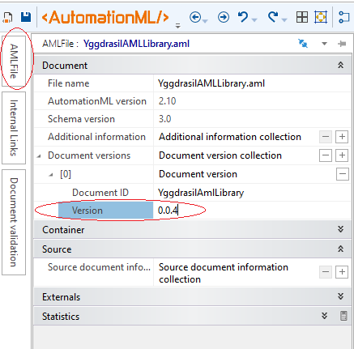
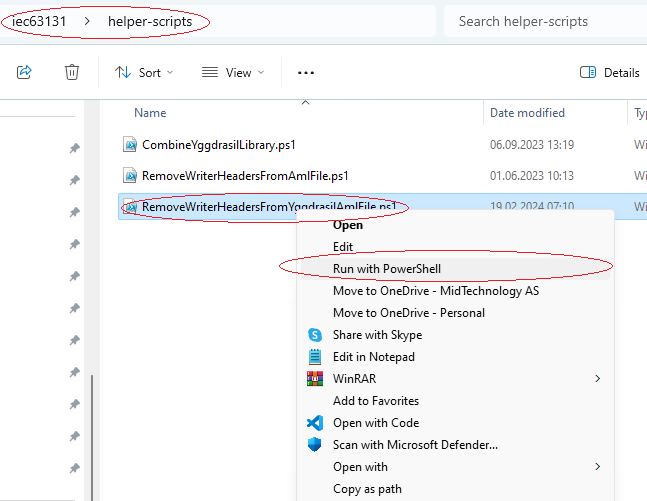
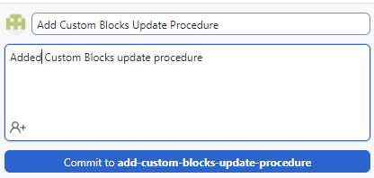
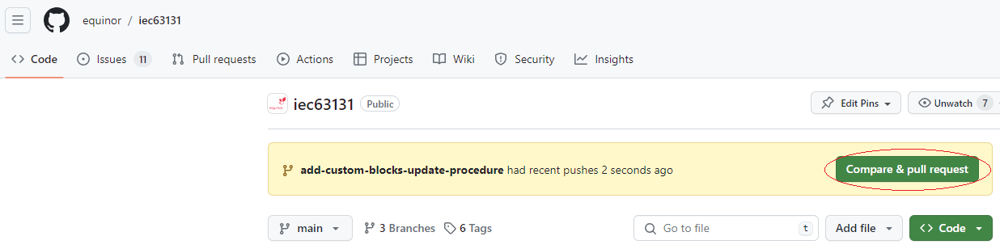
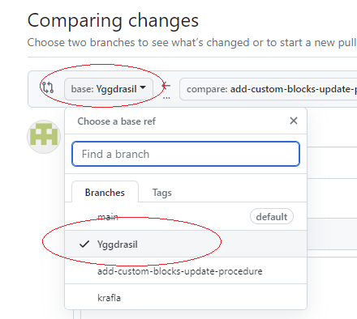

# Yggdrasil AML library

Yggdrasil branch contains library and tools for Yggdrasil project specifics

## Scope of work (SOW) for Yggdrasil branch

Development of Yggdrasil specific AML library parts:
- Context & Hiding
- Shutdown Hierarchies
- Project specific function blocks and elementary functions
- Fire & Gas specifics

## Library files purpose and composition

- NorsokSCDLibrary.aml is common iec63131 library. No project specific additions are allowed in this file
  - Changes in the common standard library shall be implemented in `main` branch, and then merged to `Yggdrasil` (reverse direction not allowed, since it would complicate things)
- YggdrasilPartialLibrary.aml contains Yggdrasil project specific additions to library (excluding vendor sections)
- YggdrasilAMLLibrary.aml is combined iec63131 and Yggdrasil library (generated by helper-script). Only vendor sections can be edited manually.

## Updating Vendor Custom blocks

YggdrasilAMLLibrary.aml is combined iec63131 and Yggdrasil library (generated by helper-script) and most parts of resulting file shall not be modified directly, excluding vendor sections.

Rules for custom blocks updating:
- Only following vendor sections could be updated directly in YggdrasilAMLLibrary.aml file:
  - FunctionBlockLibrary/VendorFunctionBlockClass
  - ElementaryFunctionLibrary/VendorElementaryFunctionClass
  - InterfaceClassLibrary/VendorSignalClass
- Library version number should be increased when initiating new pull request (PR)
- "SourceDocumentInformation" node shall be stripped from resulting file
- CHANGELOG-YGGDRASIL.md should be updated, to reflect changes
- PR shall be initiated and approved for any update
- Branch for PR shall be based on "Yggdrasil" branch
- PR shall be targeted to "Yggdrasil" branch

Following procedure should be used, when updating vendor sections. Procedure description was made with assumption of GitHub Desktop usage. If other tools are used, please refer to tools documentation to find relevant functions.
- Fetch and pull latest updates from GitHub:

  

  

- Create new temporary branch based on "Yggdrasil" branch:

  

  

- Make sure, that new branch is checked out:

  

- Make changes in vendor sections of YggdrasilAMLLibrary.aml
  - AML Editor or any text editor could be used
- Update sequential library version number:

  

- After finalizing library updates, strip SourceDocumentInfo by running "helper-scripts/RemoveWriterHeadersFromYggdrasilAmlFile.ps1" script in PowerShell:

  

- Update CHANGELOG-YGGDRASIL.md with relevant change information
- Commit changes:

  

- Publish branch to GitHub:

  

- Open iec63131 repository on GitHub and use "Compare & pull request":

  

- Change target branch to "Yggdrasil":

  

- Confirm creation of pull request

## Usage in project
The following bare minimum guidelines should be included in project guidelines:  
- Any terminal that ends with a number should be understood to extensible, meaning that multiples of that terminal may be instantiated (eg, `FlowIn1` means that it is allowed to add `FlowIn2`, ..., `FlowIn<n>`)
  - This concept should be explicitly stated for each type/terminal where it occurs in the project's guideline documents (repeat as necessary)
- Attribute `AlarmToHide1` of SystemUnitClass "Context" is extensible, ie, add attributes to hide more alarms: `AlarmToHide2`, etc.
Hierarchical compositions **shall** follow these rules (which cannot be encoded into the AML library itself):
- InternalLink shall not be used between documents (Yggdrasil rule, maybe not a general Norsok AML Library rule)
- FunctionBlock instances are not allowed outside parent `InternalElement` with `RefBaseSystemUnitPath="StructureClassLibrary/FunctionBlockStructure"`
- Elementary function (EFB) instances are not allowed outside parent `InternalElement` with `RefBaseSystemUnitPath="StructureClassLibrary/ElementaryFunctionStructure"`
  - This requirement applies for all document types where EFBs may be used
- In general DocumentElementStructure children should be from library DocumentElementClassLibrary
- In general ReferenceStructure children should be from library ReferenceClassLibrary (TODO: any exceptions? what about RefMCC?)
- Example best practice hierarchy (informative):
```xml
  <InstanceHierarchy ...>
    <InternalElement ... RefBaseSystemUnitPath="StructureClassLibrary/DocumentStructure">
      <InternalElement ... RefBaseSystemUnitPath="DocumentClassLibrary/SCD">
        <InternalElement Name="Notes" ... RefBaseSystemUnitPath="StructureClassLibrary/DocumentElementStructure">
          <InternalElement ... RefBaseSystemUnitPath="DocumentElementClassLibrary/Note">
          ...
        <InternalElement Name="PageConnectors" ... RefBaseSystemUnitPath="StructureClassLibrary/ReferenceStructure">
          <InternalElement ... RefBaseSystemUnitPath="ReferenceClassLibrary/ToDestination/SignalOffPage">
        <InternalElement ... RefBaseSystemUnitPath="StructureClassLibrary/FunctionBlockStructure">
          <InternalElement ... RefBaseSystemUnitPath="FunctionBlockLibrary/NorsokFunctionBlockClass/MA">
          <InternalLink ... />
        <InternalLink ... />
        <InternalLink ... />
      <InternalElement ... RefBaseSystemUnitPath="DocumentClassLibrary/SequenceDocument">
        <InternalElement Name="SequenceStructure" ... RefBaseSystemUnitPath="StructureClassLibrary/SequenceStructure">
          <InternalElement ... RefBaseSystemUnitPath="SequenceElementLibrary/StandardSequenceElementClass/Action">
          <InternalElement ... RefBaseSystemUnitPath="SequenceElementLibrary/StandardSequenceElementClass/Step">
          <InternalLink ... />
      <InternalElement ... RefBaseSystemUnitPath="DocumentClassLibrary/SequenceDocument">
      <InternalElement ... RefBaseSystemUnitPath="DocumentClassLibrary/SCD">
      <InternalElement ... RefBaseSystemUnitPath="DocumentClassLibrary/ShutdownHierarchy">
        <!-- same structure as SCDs basically -->
```
- Context&Hiding Transition driving logic should be encoded using elementary logic (elements from ElementaryFunctionLibrary). Output from driving logic should be connected to X input of Transition. High level on X input initiates transition.

## Tools

helper-scripts/CombineYggdrasilLibrary.ps1 script is to be used to combine YggdrasilPartialLibrary.aml and NorsokSCDLibrary.aml into YggdrasilAMLLibrary.aml, preserving vendor sections
Resulting YggdrasilAMLLibrary.aml file should be manually checked (diff with NorsokSCDLibrary.aml) to ensure correct combining
