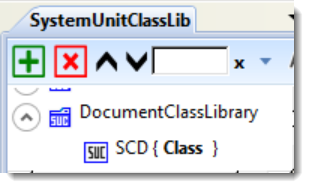
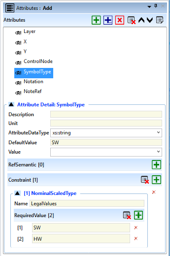
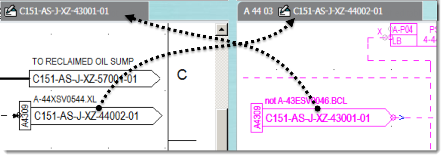
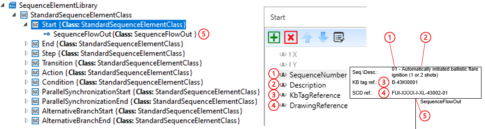

# 1 Introduction

## 1.1 Purpose and Scope

### iec63131

Repository containing library and tools for working with Norsok SCD library (AML), developed based on IEC PAS 63131:2017, which has same content as Norsok I-005 rev.3.

### Scope of work (SOW) for this repository

Facilitation of standardized encoding/decoding and exchange of IEC 63131 designs (SCDs and sequence diagrams SFCs) in machine readable format is the scope of this repository.

Changes to the IEC 63131 standard itself is strictly excluded from the scope of this repository.

### Using Issues on GitHub

Issues shall be strictly limited to the defined scope of work.

If an issue is raised that falls outside the scope of work it shall be closed without further action (ie, void and null).

Standard reply to be given: &quot;This falls outside the scope of this repo, please raise your issue via appropriate channels.&quot;

### Git LFS for binary files

Git LFS is enabled in this repository and set up to track Excel files (.xlsx), see .gitattributes config file.

Git LFS locking is not configured (not expecting multiple people to edit same Excel file).

## 1.2 References

| **Reference** | **Description** |
| --- | --- |
| IEC PAS 63131:2017 | Pre standard &quot;SYSTEM CONTROL DIAGRAM» |
| Norsok I-005 Edition 3, Mar 2013 | System control diagram |
| AutomationML | [https://www.automationml.org/o.red.c/erste-schritte.html](https://www.automationml.org/o.red.c/erste-schritte.html) |
| ISO 5457 | Technical product documentation — Sizesand layout of drawing sheets |
| Norsok Z-005 Rev. 1, October 1997 | 2D-CAD drawing standard |

## 1.3 Definitions and Abbreviations

| **Abbreviation** | **Description** |
| --- | --- |
| AML | AutomationML |
| AML-Writer | The application that create the AML file with instances |
| AML-Reader | The application that read the AML file |
| CAEX | Computer Aided Engineering Exchange |
| DQM | Data Quality Management |
| GUID | Global Unique IDentifier |
| HW | Hardware |
| IEC | International Electrotechnical Commission |
| SAS | Safety and Automation System |
| SCD | System Control Diagram |
| SIS | Safety Instrumented System |
| SW | Software |
| UUID | Universal Unique Identifier |

# 2 Workflow

Automation ML is the selected tool and format for exchange of control system information.

The SCD.AML file will only contain information that can be red from the drawing, and the focus is at the logical signal connections.

This project will set up a **class library** based on **Norsok I-005 revision 3 - System Control Diagram (SCD)**

The applied **Norsok SCD-AML class library** shall be used by the engineering company, to generate a AML file for one or several SCD&#39;s. The number of drawings contained in one AML file must be agreed in the individual projects. See recommendation in next sub chapter.

The individual SCD.AML file is shared with to the Control System Vendor, and the file contains the AML-library.

The control system vendor must have some kind of configuration to convert the SCD.AML file to proper control system format. The SCD does not include all information needed to set up the complete control system, so all relevant engineering documentation should be used in the configuration to add additional information that shall be part of the control system file.

 Figure 1 Example of workflow

## 2.1 Versioning of SCD and corresponding AML-file

Following a standardized document workflow, each SCD has its own official version.

We recommend to deliver an AML version of the same SCD together in the document archive.

There will exist 2 files that should hold the same information regarding logic. If there are any discrepancies between the two files, then the signed version should be used.

## 2.2 SCD - AML discrepancies

AML file that is generated from a SCD contains the SCD and individuals and signal relations.
 It also contains the corresponding class-library, and the receiving application can use this to check the design.

It is recommended that the AML-generator in both **source** and **destination application** , create a log with errors and warnings.

This can be used to correct own design in engineering or configuration at the control system vendor.

It can be used as part of the feedback to the responsible part.

It is recommended to include this as a Data Quality Management - DQM check as part of the SCD check process before the drawing becomes official.

**Proposal** to implement use of checksum of the produced AML to check if the AML file was changed after it was produced.

## 2.3 SCD – AML Generator

The target for converting SCD to AML is to be able to import Function Block (FB) and Logic with signal connections into a neutral format that can be used by any control system vendor.

The content of what we get in the AML-file should be limited to what is displayed on the drawing.

The SCD is in some cases simplified for drawing purposes. These simplifications should normally be documented in a SCD legend or in the SCD-development guideline for the actual project.

**_NOTE_**: It is not a topic for the SCD-AML generator to add template information to the AML-file.

## 2.4 SCD.AML – Control System Generator

The control system vendor receives SCD.AML file&#39;s and must convert these into their own programming language. Each of the AML files contains the library and this must be mapped to the control system vendor&#39;s internal classes.

Additional missing information in the SCD.AML file can be collected added from relevant project engineering documents.

## 2.5 Control System – AML Generator

To be able to check existing control system design against incoming AML file, an extraction of existing design and converting this to the standard AML design will give an option for comparing the two AML files for discrepancies.

It is recommended that the vendor develop such solutions.

# 3 Content of a Automation ML file - AML

Editor and information about the tool can be found her:

[https://www.automationml.org/o.red.c/erste-schritte.html](https://www.automationml.org/o.red.c/erste-schritte.html)

- Whitepaper AutomationML Part 1 - Architecture and general requirements
- Whitepaper Part 2 - Role class libraries
- Whitepaper Part 4 - Logic Description

Introduction to editor: [https://www.youtube.com/watch?v=YBCVM3puKZU](https://www.youtube.com/watch?v=YBCVM3puKZU)

## 3.1 AML Editor

## 3.2 AML file

Required Structure of AML file is defined in Part-1:

- chapter 5.3 &quot;AML Document versions&quot;
- The AML writer application should fill in the metadata ref chapter 5.4 &quot;Meta information about the AML source tool&quot;

## 3.3 Object Identification

Reference Part-1 chapter 5.5

| **AML Classes** | **AML Object Instances** | **CAEX Interfaces** |
| --- | --- | --- |
| RoleClass  InterfaceClasse  SystemUnitClasse | CAEX InternalElements  CAEX ExternalInterface | |

### 3.3.1 Rule for Classes:

Identification of AML Classes shall be identified by their CAEX &quot;_Name_&quot;

Name shall be unique within the hierarchy level of the corresponding AML library

Reference to classes shall be done via full path.

### 3.3.2Rule for Instances:

Identification of AML Object Instances shall use CAEX tag: &quot;_ID_&quot;

The &quot;ID&quot; shall be Universal Unique Identifier - UUID

This can be implemented as a Global Unique Identifier – GUID

The UUID shall never change over the life time of the corresponding object within all participating tools.

Referencing instances shall use the &quot;ID&quot; and not the &quot;Name&quot;, as this can change over time.

| Example of Child-Parent relation: AML Class with reference to the owner class full path. |  |
| :--- | :--- |
| Example of a InstanceClassLibrary object implemented as an individual in a SystemUnitClass.  This individual has a requirement for use of &quot;ID&quot; and a global unique identifier GUID has been added |  |
| Example of an Individual in the Instance Hierarchy.  This object is an individual of a SystemUnitClass and has a requirement for &quot;ID&quot; and a &quot;Name&quot;   Name = Tag number ID = unique ID in the source system. |  |

### 3.3.3 AML Object Relations:

ref Part-1 chapter 5.6

Parent-Child relations between AML object instances use AML &quot;_InternalElement_&quot; to represent hierarchical object structure.

Parent-Child relations between AML classes use a parent-child relations:

Class Inheritance relation to InterfaceClass

### 3.3.4 Class – Instance Relation:

Singleton: AML Individual created without relation to a SystemUnitClass.

Normal AML individuals shall be created based on a SystemUnitClass. And will then get a complete copy of the structure and attributes from the SystemUnitClass object. The SystemUnitClass act as a &quot;copy template&quot; and there is no inheritance from the class to individuals.

_ **Note** _: according to ref 5.6.5 it is allowed to reduce and expand data copied from the SystemUnitClass.

_ **Recommendation for use of the NorsokLibrary** _: keep all function block interfaces as defined in the template library for easy check of changes and consistency.

### 3.3.5 Instance – Instance Relation:

ref Part-1 Ref 5.6.6

CAEX InternalLinks object hold relations between two instances. It shall be stored at the CAEX InternalElement which is the lowest common parent of the two connected objects.

**In the Norsok SCD &quot;InstanceHierarchy&quot; model this will be below the SCD-Document.**

| Name syntax: &quot;Link-&quot; + Number  References is added to &quot;RefPartnerSideA&quot; and &quot;RefPartnerSideB&quot;  Reference syntax: &quot;ID&quot; of the interface Owner + &quot;:&quot; + InterfaceName |   XML:  \&lt;InternalLink Name=&quot;Link35&quot; RefPartnerSideA=&quot;744651ea-66d9-4133-5339-323932573949:Out&quot; RefPartnerSideB=&quot;744651ea-66d9-4133-5341-303454413448:X&quot; /\&gt;  Navigator:   |
| :--- | :--- |

# 4 Norsok SCD AML library

StructrueClassLibrary The SCD converted drawing(s) will be represented as an instance hierarchy in AML.

The instance is by default a copy of an AML class and then modified with instance properties and relations.

**Proposed InstanceHierarchy:**

Level 1: InstanceHierarchy individual: Project or Facility Name

Level 2: Document Structure

Level 3: Document Individual

Level 4: InternalLinks between individuals in Level 5

Grouping of SystemUnitClass information.

Level 5: Individuals of the different SystemUnitClasses
 Note: Individuals must have unique names in same folder.

The AML-Writer shall add individuals of different SystemUnitClassLib to the structure objects below the DocumentIndividual.

## 4.1 Individual

Individuals are defined with a header and properties.

| Field - description | |
| --- | --- |
| **ID**: Unique id for the individual from the source application   **Name: **&quot;Tag number&quot; in the source application   **Description:** Used where applicable e.g at On/OffPage references    **RefBaseSystemUnitPath:** Reference to the _SystemUnitClass_ |  |
| **Attributes** are defined at the AML class and populated with values at the instance level.    The AML-Writer Some attributes has got constraint and limitations of what can be set. See library for details. |   |

## 4.2 Position and Layer information

If it is required to deliver symbol position:

A 2D-drawing has a Cartesian coordinate system in two dimensions (also called a _rectangular coordinate_ system or an orthogonal coordinate system). Ref [https://en.wikipedia.org/wiki/Cartesian\_coordinate\_system](https://en.wikipedia.org/wiki/Cartesian_coordinate_system)

The definition of the coordinate system and drawing orientation is set in the document individual.

It is mandatory that this is set so that the AML-reader knows how to use the information.

All symbols placed on a drawing has a symbol origo. The Symbol origo has a reference to the drawing origo.

_Note_: SignalInterface (Terminal names) has not got these attributes in this version of the AML.

| **Attributes** | **Value** | **Unit** |
| --- | --- | --- |
| X | | mm |
| Y | | mm |

If required by the project it is possible to add Layers defined by the standard or additional layers defined by the project.

To be able to hold this information all symbols placed on a drawing has got the following attribute

| **Attributes** | **Value** |
| --- | --- | 
| Layer |

## 4.3 DocumentClassLibrary

The SCD is an individual in the instance hierarchy with some attributes defined at the SCD – class.

 

Document properties:

| Header | Value | Example |
| --- | --- | --- |
| Name | _Document Number_ | _C151-AS-J-XZ-43002-01_ |
| Description | _Document Title_ | _LP flare KO drum_ |
| Version | _Current Revision_ | _05_ |
| ID | _UUID_ | _744651ea-66d9-4133-4b44-4e51445a3838_ |

| Attributes | Value | Restrictions |
| --- | --- | --- |
| DrawingSize | | A1 |
| Orientation | | Landscape |
| CoordinateSystem | | Cartesian coordinate system orientation: right-handed_ **Note** _: required if reference to symbol position is used. |
| Scale | | NA |
| Area | | |
| System | | |

## 4.4 DocumentElementClassLibrary

Class library of objects related to the document and general objects like Note and Revision Trinagle. 

### 4.4.1 RevisionRecord Class

The document revision matrix is treated as individual record set in the AML file. The columns in the matrix are properties at the record set.

In the example below this will be represented by 5 individuals in the AML document

 

Properties of RevisionRecord class

| **Header** | **Value** | **Example** |
| --- | --- | --- |
| Name | &quot;_Rev-&quot; + Version_ | _Rev-01_ |
| Description | &quot;_Reason for issue&quot;_ | _INTER DISCIPLINE CHECK_ |
| Version | _Revision code_ | _01_ |
| ID | _UUID_ | _ffefb00b-987c-47a8-a47c-500c64fed20d_ |
| Attributes | Value | |
| RevisionDate | | _10.06.2015_ |
| CreatedBy | | _PB_ |
| CheckedBy | | _Abi_ |
| ApprovedBy | | _REK_ |

### 4.4.2 Note properties

Note is a text placed somewhere at the drawing.

The individual symbols can have a reference to the note, and has a separate attribute for this purpose.

This can be used to find the actual note.

| **Header** | **Value** | 
| --- | --- |
| Name | &quot;_Note-&quot; + Number_ |
| Description | _Note Description_ |
| Version | |
| ID | _UUID_ |

| Attributes | Value | Unit |
| --- | --- | --- |
| X | mm | |
| Y | mm | |

## 4.5 FunctionBlockLibrary

Function Block properties

 

Control Function Integration:

 

| **Header** | **Value** | **Example at individual** |
| --- | --- | --- |
| Name | _Tag number_ | _A-43LIC0135_ |
| ID | _UUID_ | _744651ea-66d9-4133-4c37-563433325255_ |
| RefBaseSystemUnitPath | | _FunctionBlockLibrary/NorsokFunctionBlockClass/CA_ |

| Attributes | Value | Unit | _Example_ |
| --- | --- | --- | --- |
| Layer | | | |
| X | | mm | |
| Y | | mm | |
| ControlMode | | | _DIR_ |
| ControlNode | | | _A-U01_ |
| ControlFunctionIntegration | | | _I_ |
| AdditionalText | | | |
| NoteRef | | | |

The class library is defined based on the definition in the standard and one level where vendor specific Function Blocks can be created. If the AML-writer doesn&#39;t find the correct class in none of these two then the &quot;NonStandardFunctionBlockClass&quot; can be used. It will then be possible to find and handle these individuals.

| Class Library | Attributes |
| --- | --- |
|  |  |

FunctionBlock Terminal Names defined in the standard are realized in AML with use of ExternalInterface

Attributes belonging to these objects are defined in InterfaceClassLibrary ref. chapter 4.2.

Ref 5.1 Issue: SignalInterface – Names are omitted at many symbols

If no project agreement is made then these unnamed terminals at Function Block should be represented by the generic Interface Class &quot;_In_&quot; and &quot;_Out_&quot;. Ref 4.5.5NorsokSignalClass.

## 4.6 ElementaryFunctionLibrary

NorsokElementaryFunctionClass and InputParameterClass

| Class Library | Attributes |
| --- | --- |
|  |    Additional attributes for Pulse and Timer:      |

Some of the NorsokElementary functions can have n-number of input or output terminals.
 The AML-writer shall add additional terminals and use the same RefBaseClassPath as the existing terminals.
 Example:

- Split and Opt: can have one input **X** and several output **Y1**, **Y2**, &quot;**Yn**&quot;.
- Or, XOR, AND, Add and Mul: can have several input **X1**, **X2**, &quot;**Xn**&quot; and one output **Y**.

### 4.6.1 NodeSplit class

This class is defined as part of the ElementaryFunctionLibrary

| Class Library | Attributes |
| --- | --- |
|  |  |

## 4.7 ReferenceClassLibrary

**Page reference** symbols exist as a set of symbols pointing to each other.

The Page reference for Signal has a Unique identifier that can be used as Name.

The AML reader application should find the same Page reference Name in the DrawingReference - AML file and then the signal path can be followed at the opposite drawing.

 

| **Header** | **Value** | **Example SignalOffPage** | **Example SignalOnPage** |
| --- | --- | --- | --- |
| Name | _Name_ | A4309 | A4309 |
| Description | _Description_ | A-44XSV0544.XL | Not A-43ESV0046.BCL |
| ID | _UUID_ | ……A.. | …..B.. |

| **Attributes** | **Value** | **Example SignalOffPage** | **Example SignalOnPage** |
| --- | --- | --- | --- |
| DrawingReference | _DrawingNumber_ | C151-AS-J-XZ-44002-01 | C151-AS-J-XZ-43001-01 |

**Shut-Down / SIS - References**

| **Header** | **Value** | **Example** |
| --- | --- | --- |
| Name | _Name_ | SIS-1 |
| ID | _UUID_ | ……. |

| **Attributes** | **Value** | **Example** |
| --- | --- | --- |
| SIS-Notation | _Control system Character_ | E |
| Reference | _Reference to SIS-Level_ | 1.2 |

**Sequence References** :

| **Header** | **Value** | **Example** |
| --- | --- | --- |
| Name | _Name_ | SEQ.03 |
| ID | _UUID_ | ……. |

| **Attributes** | **Value** | **Example** |
| --- | --- | --- |
| Reference | _Reference to sequence step numbers_ | 1 |

**Reference to Electrical Equipment Control**

 

| Header | Value | Example | 
| --- | --- | --- |
| Name | _Name_ | MCC-Ref-TagNumber | 
| ID | _UUID_ | ……. | 

| Attributes | Value | Example | 
| --- | --- | --- |
| ReferenceTagNo | Power reference Tag number | | 
| ReferenceSystem | _Power or Succeeding function_ | MCC | 
| Typical | | | 

## 4.8 DeviceClassLibrary

The current version of the AML library has defined some common devices used by the SCD.

If devices shall be represented in the InstanceHierarchy or not is not decided yet.

| **Header** | **Value** | **Example** |
| --- | --- | --- |
| Name | _Name_ | A-43VD002 |
| ID | _UUID_ | ……. |

|  | **Default properties for all Devices**    |
| :--- | :--- |

Some devices with additional properties

| **Device with additional attributes** | **Device with additional attributes** |
| :--- | :--- |
| **Damper**    | Actuated Damper    |
| **Valve**    | **Actuated Valve**    |

 

## 4.9 InterfaceClassLibrary - Connections and Terminal Names

   At the SCD, Termination points are given by name and signal directions are given by arrow.

 

In AML the termination point is defined as a &quot;Signal Interface Class&quot;

The individual Function Block and Logic classes are populated with legal combination of Signal Interface Classes.

### 4.9.1 Consistency check

The restrictions in the attributes can be used for quality check of the connections between two Interface Classes.

It is recommended that the AML-Writer do such quality check when creating InternalLink between Iterface Classes.

The AML-Reader should also perform such check to ensure legal connection.

### 4.9.2 Attribute &quot;Active&quot;

This is a Boolean datatype and is used to indicate that the terminal is in use at the SCD.

When creating an instance of e.g. a Function Block then all interface classes from the library is copied to the individual. To know if e.g a warning is used is not possible without additional flag.

&quot;Active = true&quot; give an easy way to find terminals that the AML-Reader should evaluate.

### 4.9.3 Attribute &quot;CommunicationType&quot;

This is type of information is additional information about the connection between the terminals. 

The InternalLinks cannot have additional attributes. That is why this is added at each of the connectors. 

### 4.9.4 Attribute &quot;InvertSignal&quot;

Ref to Norsok I-005 &quot;Positive logic&quot;:

_The positive logic shall always be applied for function terminals i.e. there shall be no parameters to invert the signals inside the functions which negate the terminal meaning._

_An exception is made for input X on MB where_ _an inverter is added to make it possible to adapt to normally energised or non-energised input signal._ The Attribute InvertSignal is used for this purpose and a variant of the &quot;X&quot; is created in the library.

This special class is then added to the MB function Block

Invert is also used at device and reference object and is indicated with double arrows at the SCD.

  

### 4.9.5 NorsokSignalClass

The library is developed with hierarchical structure with inheritance of attributes.

Attribute restriction are added at the different levels.

### 4.9.6 VendorSignalClass

This class is created to be able to populate VendorFucntionBlockClass with vendor specific signalInterfaceClasses.

This library should use the same structure and restrictions as in the NorsokSignalClass library.

This is done to be able to run standard consistency checks at attribute level.

#### 4.9.6.1 How to assign a InterfaceClass to a SystemUnitClass

1. Define the SystemUnitClass if it does not exist. E.g. a vendor specific function block
2. Define InterfaceClass object if it don&#39;t exist
3. Drag a InterfaceClass object onto the object a)
4. Change name and description of the new object c)
5. check that attribute definition for then new object is correct.

### 4.9.7 SignalReferenceClass

This interface Class is intended to be used by SystemUnitClass: ReferenceClassLibrary

These objects are passing signals and has limited attributes.

### 4.9.8 DeviceConnection

This connection class is of AutomationMLInterfaceClassLib PPRConnector.

Ref Part1 6.3: This class is intended for _&quot;Connector for interlinking products, resources or processes &quot;_

Modelling of Process Flow (Pipes) is not done in this AML library yet.

Some example classes is linked to these interface classes, must be developed more it this shall be used.

# 5 Sequence Flow Chart (SFC)

## SFC introduction

SFC is defined in the Norsok standard.

Section under work

## SFC symbols

### Sequence start and reference symbol

### Step symbol

### Action symbol

### Transition symbol

### Condition symbol

### The END symbol

### Parallel Synchronization Start Line

### Parallel Synchronization End Line Connections

### Alternative Branch Start Line Connections

### Alternative Branch End Line Connections

### Off Page Symbol Connections

### On Page Symbol Connections

